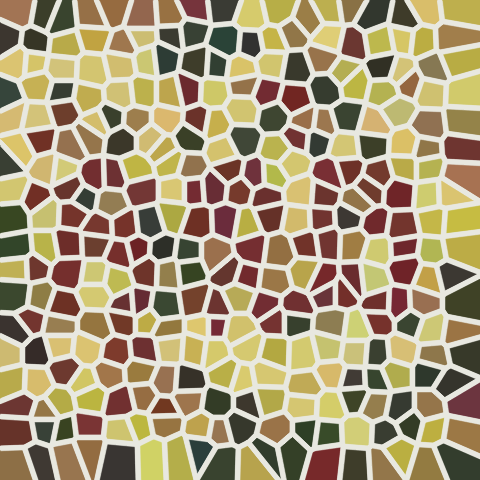
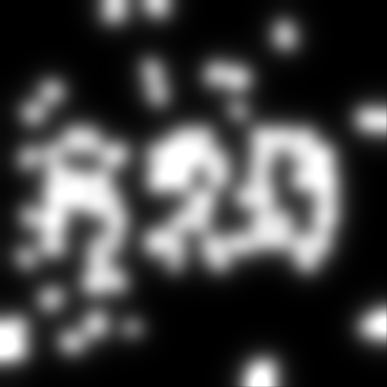
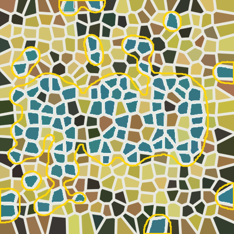
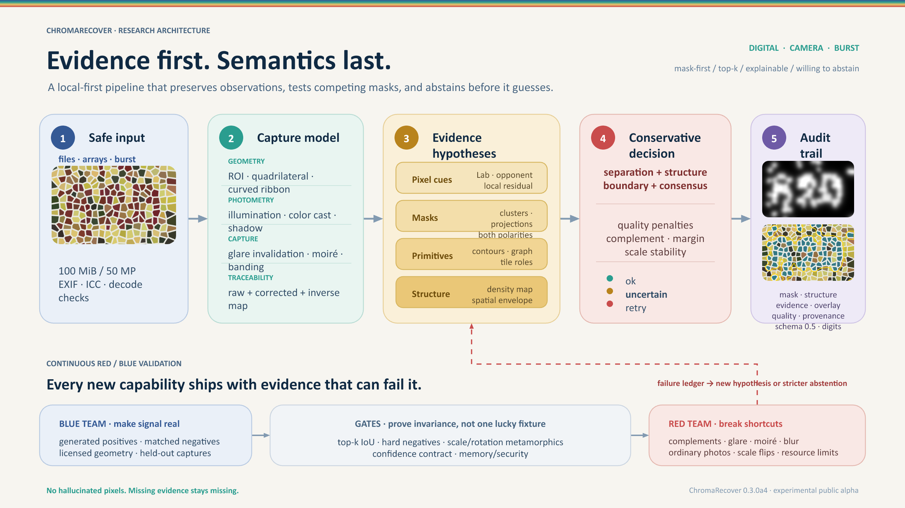

# ChromaRecover


[](https://github.com/niansia/ChromaRecover/actions/workflows/ci.yml)

ChromaRecover is a local-first Python tool that recovers and visualizes spatial structures
carried by subtle color differences. It returns top-k masks, overlays, quality warnings and
an explicit `ok`, `uncertain` or `retry_recommended` status instead of forcing a text guess.

> Alpha scope: digital mode is the stable baseline. Experimental Camera Alpha adds
> conservative document rectification/dewarping, paper and screen capture profiles,
> multi-frame fusion, glare
> invalidation, mild restoration hypotheses, and evidence mapping back to the photograph.
> `mode="auto"` recognizes strong screen-capture moire and otherwise falls back to digital.
> Select `camera-paper` explicitly for paper photographs until that route has independent
> device-held-out calibration.
> Confidence is deliberately conservative and is not calibrated on device-held-out data.

| Matched-histogram mosaic | Continuous evidence | Auditable overlay |
| --- | --- | --- |
|  |  |  |

This repository-owned generated case hides `820` in the local population of one polygon
color, while using the same number of special-color primitives as its random negative. The
evidence map makes the spatial signal visible; this deterministic run is `ok`, while a case
with equally plausible competing masks remains `uncertain`. That is intentional
evidence-first behavior, not an OCR promise.

## Research architecture



The recovery path and its continuous red/blue validation loop are shown together: input
safety, capture modelling, multi-family evidence hypotheses, conservative decision and
auditable artifacts. The figure is built from native slide objects and remains editable in
[the PowerPoint source](docs/assets/ChromaRecover-research-architecture.pptx).

## Why ChromaRecover?

Some structures are encoded mainly by relative color instead of strong brightness edges.
That can make them difficult for people, OCR systems and general vision models to interpret
reliably. ChromaRecover exposes the visual evidence before attempting a label:

- recover structure before OCR or digit interpretation;
- run locally on CPU without uploads, accounts or telemetry;
- return uncertainty instead of inventing an answer when evidence is weak.

**If the evidence is weak, ChromaRecover says so.**

## Install

Until the first package registry release, download or clone this repository, open its root
directory, and install the tracked source:

```
python -m pip install .
```

For contributor tools and tests:

```
python -m pip install ".[dev]"
```

On Windows Python 3.10, a repository path containing non-ASCII characters can expose an
upstream editable-install `.pth` encoding issue. The normal non-editable install shown above
is the reliable workaround; Python 3.11+ is recommended for development.

## Python

```python
from chromarecover import recover

result = recover("image.png", mode="digital", top_k=3)
result.save("result")
if result.best is None:
    print(result.status, "no defensible candidate")
else:
    print(result.status, result.best.decision_confidence)
```

`result.best` is deliberately `Candidate | None`: a blank, near-uniform or otherwise
low-information image returns a normal `uncertain` result with no candidate instead of
inventing one.

Digit interpretation is optional and runs only after visual evidence exists:

```python
result = recover("plate.png", semantics="auto")
print(result.semantics)  # hypothesis, confidence, acceptance reason, candidate agreement
```

It uses multi-font shape distance, holes/topology and projection-based glyph segmentation.
Only an accepted reading appears in the public `hypothesis` field. Unaccepted template
labels remain character-level diagnostic alternatives under each candidate, so a weak `4`
cannot look like the tool's answer. A digit hypothesis does not alter the mask or turn
missing pixels into evidence.

Strong agreement from three candidate masks spanning at least two independent visual
evidence families may accept a readable digit sequence even while the recovery result
remains `uncertain`. This validates shape only: it cannot promote visual status, rerank
candidates or claim missing pixels.

For a camera image, automatic quadrilateral detection is enabled by default. When the
document boundary is ambiguous, pass either a crop or four corners in original-image
coordinates:

```python
result = recover("photo.jpg", mode="camera", roi=(120, 80, 1880, 1320))
result = recover(
    "photo.jpg",
    mode="camera",
    document_corners=[[130, 92], [1872, 65], [1904, 1318], [105, 1340]],
)
```

Supplied corners must be four distinct finite points forming a usable convex quadrilateral
in original-image coordinates. A small 10% coordinate margin is allowed for subpixel or
slightly off-frame estimates; non-finite, repeated, degenerate or implausibly distant points
raise `InvalidInputError` before a perspective transform is attempted.

Use `camera-paper` when wrinkles and illumination dominate, or `camera-screen` when refresh
banding and moire dominate. Generic `camera` chooses between those profiles from measured
evidence. Automatic dewarping uses only observed page boundaries and abstains when geometry
is not credible.

When glare or occlusion moves between photographs, burst fusion can recover from pixels that
were genuinely observed in another frame:

```python
from chromarecover import recover_burst

result = recover_burst(
    ["frame-1.jpg", "frame-2.jpg", "frame-3.jpg"],
    mode="camera-screen",
    return_debug=True,
)
```

Camera correction estimates nuisance fields. It does not claim that clipped, occluded or
severely blurred single-frame information has been recovered. Inspect
`result.quality.warnings` and retry the capture when requested.

An `ok` result always uses the same public confidence represented by
`best.decision_confidence`; evidence-family gates cannot substitute a second score to cross
the configured threshold. Camera/auto status remains uncalibrated until independently
licensed, source-group-held-out captures are available.

`ok` means that the system found a coherent chromatic spatial structure satisfying this
decision contract. It does **not** prove that an ordinary photograph contains an intended
hidden message or that any semantic interpretation is correct.

## CLI

```
chromarecover image.png --out result --top-k 3 --semantics auto
chromarecover photo.jpg --mode camera --roi 120,80,1880,1320 --out result
chromarecover --burst one.jpg two.jpg three.jpg --mode camera-screen --debug --out result
```

The output directory separates three meanings: `mask_01.png` is the selected color-support
class, `structure_01.png` is its spatial envelope, and `evidence_01.png` is continuous local
support. `overlay_01.png` displays both, and schema `0.5` `result.json` records transforms,
quality and provenance. Full-resolution support and structure masks stay in original-image
coordinates. To prevent phone-image memory spikes, continuous evidence and overlays are
bounded to a 2048-pixel presentation space and record their dimensions and scale under
`artifact_spaces`. `--debug` also saves corrected observations, invalid regions, primitive
labels and any restoration hypotheses.

Confidence is likewise separated: `structure_confidence` describes the candidate before
capture penalties, `capture_confidence` includes input quality, and `decision_confidence`
also includes ambiguity and final status. `overall_confidence` remains a compatibility alias
for `decision_confidence` during alpha.

## Design guarantees

- Mask-first: OCR or filenames do not decide the recovered pixels.
- Semantics-last: optional digit recognition can validate readable shape, but never generate
  color support or override abstention from weak visual evidence.
- Multi-hypothesis: foreground color, polarity and area are not hard-coded.
- Layered camera path: geometry, photometric nuisance estimates, raw/corrected color
  evidence, native polygon primitives, local distribution maps, graph grouping, and inverse
  mapping stay auditable.
- Evidence preservation: burst fusion uses registered observations; single-frame deblurring
  is exposed only as a bounded hypothesis branch and never relabeled as ground truth.
- Conservative failure handling: readable but inconclusive input is not an exception.
- Local-first: no uploads, accounts or telemetry.
- Reproducible: deterministic seeds and a config fingerprint are stored with each result.

See [the algorithm notes](docs/algorithm.md) and [project contract](PROJECT_SPEC.md).

## What this is not

This is not a medical diagnostic tool and does not reconstruct physically true colors or
original pixels from a single camera image. Severe blur, clipping, glare, occlusion and
undersampling can destroy information permanently. Deep non-developable crumples need a
learned or calibrated surface model and remain outside this CPU alpha.

The default safety ceiling is 50 megapixels, enough for an 8064×6048 phone original. On the
reference Windows host that 48.8 MP camera case peaked near 0.82 GiB instead of being killed
at roughly 5 GiB; a 24 MP case peaked near 0.50 GiB. Memory-limited systems should still crop
to the plate or downsample once with a high-quality decoder before recovery.

Filesystem inputs are limited to 100 MiB before image decoding. Burst input is checked
before decoding and is limited to 2–12 frames and 80 megapixels in aggregate. This is
separate from the 50 MP single-frame limit because registered fusion keeps multiple float
working arrays; crop or downsample large bursts first. Embedded ICC profiles are capped at
4 MiB before LittleCMS parsing; oversized profiles are ignored and reported in preprocessing
provenance. The local library does not pretend to provide a safe in-process decoder timeout.
Network services must add process isolation, wall-time and memory limits as described in
[the security model](docs/security-model.md).

Inline typing is best-effort during Alpha. The package includes `py.typed`, but a complete
OpenCV/NumPy static-type gate is a documented v0.4 task; the current marker should not be
read as a promise that every internal array operation is already mypy-clean.

## Roadmap

The current priorities are independently licensed camera captures, broader primitive
families, lower-memory burst processing and measured performance work. Completed scope and
release gates are tracked in [the public roadmap](docs/roadmap.md); new features are expected
to arrive with both a regression case and a hard negative.

Small, bounded tasks suitable for a first contribution are prepared in
[the contributor ideas](docs/contributor-ideas.md). They can become `good first issue` tickets
after the public GitHub repository exists.

## Development checks

```
pytest
ruff check .
python benchmark/evaluate_synthetic.py --assert-thresholds
python benchmark/evaluate_nuisance.py --assert-thresholds
python benchmark/evaluate_mosaic.py --assert-thresholds
```

CI runs the supported dependency range at both ends, including NumPy 1.26/OpenCV 4.10 and
NumPy 2.x/OpenCV 4.14 on Python 3.10 through 3.13. The checked-in golden inventory contains
20 deterministic generated cases (12 dot-pattern and 8 polygon-mosaic cases); it does not
claim those are real camera photographs. External camera geometry is evaluated separately
on the licensed SmartDoc dataset without committing third-party frames; see
[`docs/external-datasets.md`](docs/external-datasets.md). A private blueprint-derived fixture
is not part of the public tree or tooling and is not required by CI.

The current warm-process reference timing for a 1920×1080 generated mosaic is about 1.35 s
in digital mode and 2.01 s in camera mode on the development Windows host. The original
one-second goal is therefore not yet met for camera processing; these numbers are diagnostic,
not a cross-machine performance guarantee.

To create a source archive without local environments or `tmp/`, run the Windows packaging
helper `powershell -File scripts/package_source.ps1`; it packages tracked files from `HEAD`
only. PyPI publication is intentionally deferred until the public-alpha checks pass; the
current install command does not pretend a registry release already exists.

ChromaRecover is licensed under Apache-2.0. Community governance will continue to mature
throughout the Public Alpha cycle and on the path toward 1.0.
